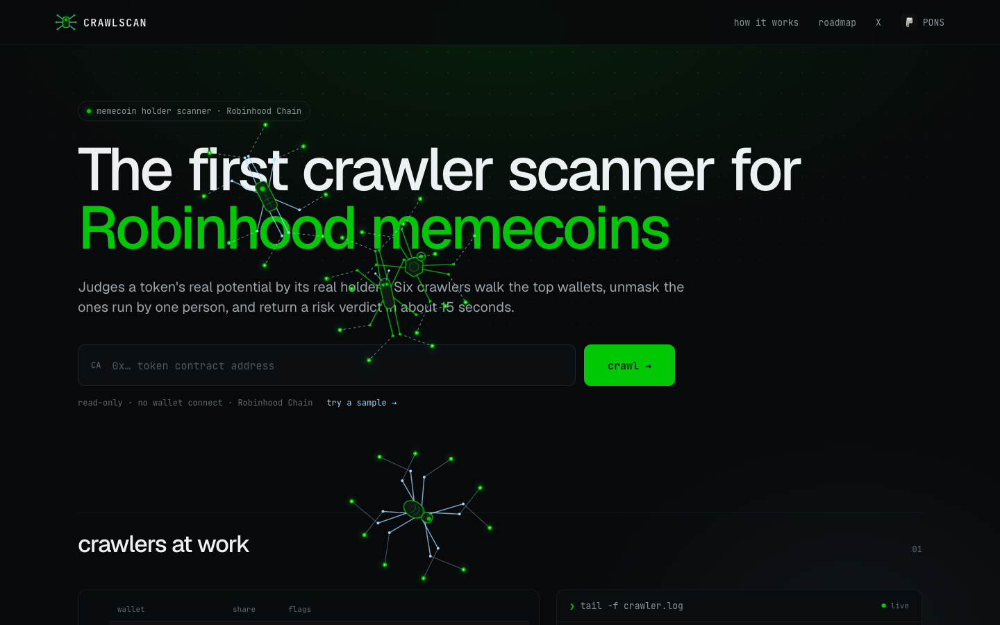

<div align="center">


# CRAWLSCAN

**Crawlers that catch one wallet wearing many.**

[](https://crawlscan.fun)


[](LICENSE)



</div>

## What it does

Paste a Pons V2 memecoin address on Robinhood Chain. Six crawlers walk the top 20 holders on-chain and answer one question: is this a crowd, or one person behind many wallets? You get a verdict in seconds:

> **20 wallets → 4 operators, biggest holds 38% of float**

## How the crawlers work

Everything comes from the token's full transfer history since launch. Curve, pool, locker and routers are never counted as holders, and every share is measured against the real circulating float.

**What they check on each wallet**

- **Bought vs received**: did the wallet buy on the market or get tokens by transfer.
- **Virgin wallets**: never traded a token before this one.
- **History depth**: how many tokens the wallet traded before entering.
- **Snipers**: entries in the first seconds after launch.
- **Deployer**: what the creator still holds and whether they sold.

**How they link wallets**

- **Proven links**: same buy transaction, tokens from the same ordinary wallet, or direct transfers between holders. Linked wallets merge into one operator.
- **Packs**: fresh wallets buying in the same block with matching sizes. A behavioural link that counts with a lower weight.
- Exchanges, distributors and contracts never link wallets.

## Verdict

A score from **0 to 100** (100 = clean), built from five parts:

| | |
|---|---|
| Operator | share of float held by the biggest operator |
| Virgin | share of virgin wallets in the top |
| Transfer | float received instead of bought |
| Sniper | float still held by snipers |
| Concentration | how much the top 20 hold |

Hard red flags force `DANGER`; any pack or multi-wallet operator caps the verdict at `RISKY`; too few holders gives `TOO EARLY`.

<div align="center">

</div>

## Tech

- **Python standard library**: zero runtime dependencies.
- **Read-only**: no keys, no signing, no transactions.
- **Alchemy RPC** for Robinhood Chain, GeckoTerminal for market data.
- **Transaction-level trade classification**: buys through third-party bot routers still count as buys.
- **Parallel crawl** under a hard time budget: slow wallets never block the verdict.
- **Live event stream**: the page plays the crawl step by step as it happens.

## Run locally

```sh
echo "CRAWLER_RPC=https://robinhood-mainnet.g.alchemy.com/v2/<your-key>" > .env
python3 server.py
```

Open http://localhost:8000, or go straight to `http://localhost:8000/?ca=0x...`.

## Roadmap

- [ ] Telegram bot
- [ ] Operator memory across launches
- [ ] Launch radar
- [ ] Wallet profiler
- [ ] Watchlists & alerts
- [ ] Multichain
- [ ] Track record
- [ ] Browser extension

## License

[MIT](LICENSE)
