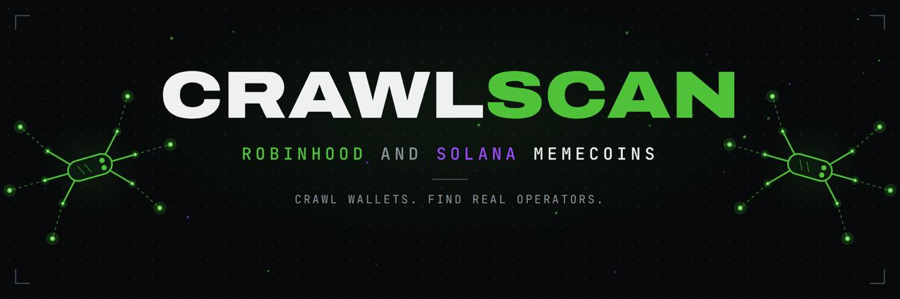
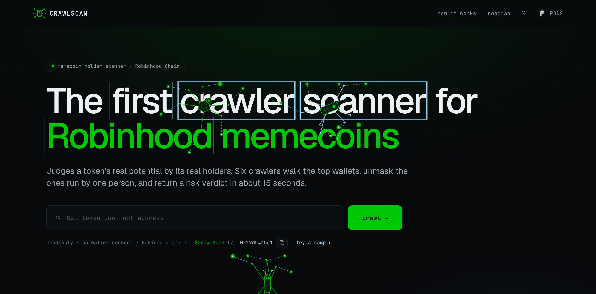
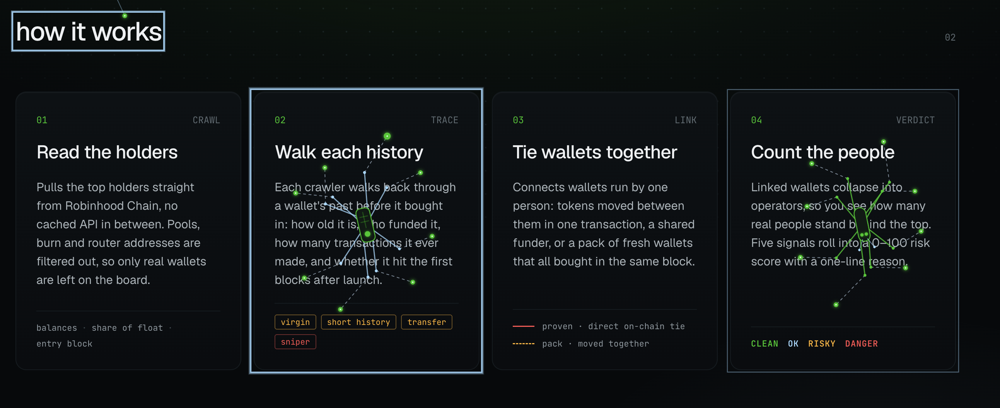
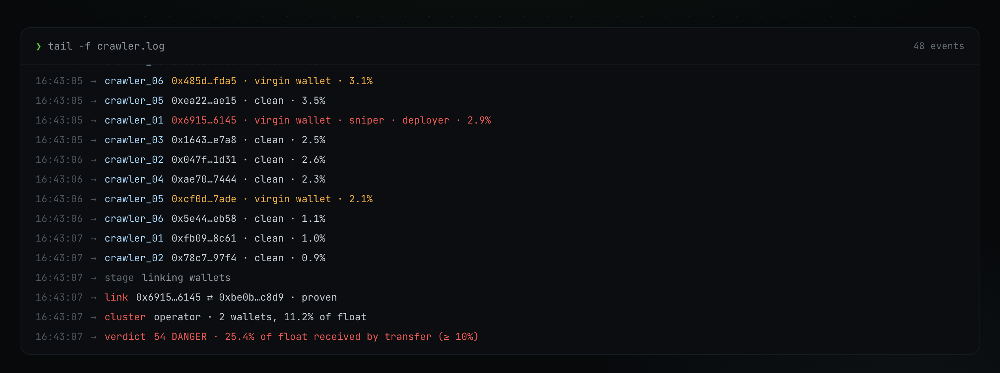
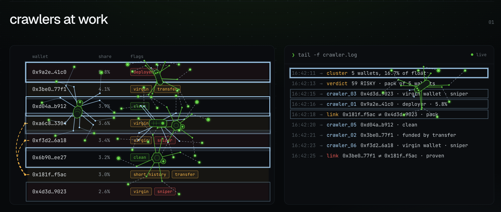
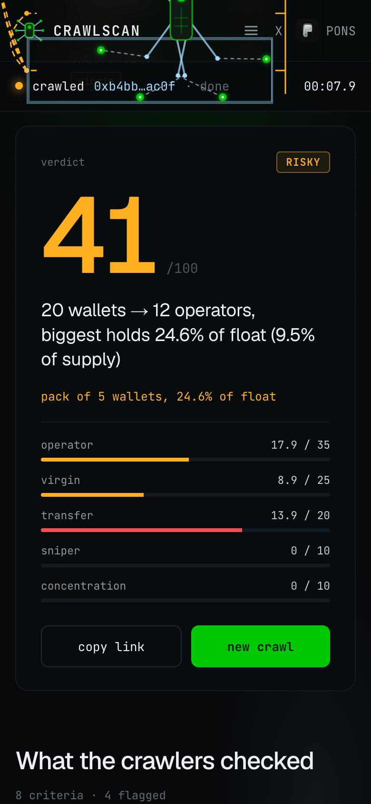

<div align="center">


# CRAWLSCAN

**Crawlers that catch one wallet wearing many.**

Terminal access: https://crawlscan.fun/

Telegram bot: [@CrawlScanBot](https://t.me/CrawlScanBot)

[](https://crawlscan.fun)


[](LICENSE)
[](https://github.com/0xPunisher/crawlscan/actions/workflows/tests.yml)



</div>

## What is CRAWLSCAN?

**CRAWLSCAN is an on-chain token intelligence engine built to detect hidden wallet concentration, coordinated buying and suspicious holder behaviour in seconds.**

Instead of simply showing how many holders a token has, CRAWLSCAN tries to answer the question that actually matters:

> **How many real participants are behind those wallets?**

A token can show hundreds of holders while a surprisingly large portion of its supply is controlled by the same person, the same group, or a network of connected wallets.

CRAWLSCAN crawls the token's on-chain activity, analyses its top holders, follows transfers and trading behaviour, identifies wallet relationships, and turns the result into a simple **0-100 score**.

The goal is to make a complex on-chain investigation understandable in seconds, without requiring users to manually inspect hundreds of transactions.



### The core idea

Paste a token address. CRAWLSCAN detects the chain and the launchpad automatically and returns a verdict such as:

> **20 wallets -> 4 operators, biggest holds 38% of float (9% of supply), could move price -45% if sold**

What normally requires manual blockchain analysis is reduced to a few seconds.

### Supported chains and launchpads

| Chain               | Launchpads | Explorer links |
| ------------------- | ---------- | -------------- |
| **Robinhood Chain** | **Pons V2** (bonding curve and Uniswap V4 pools)<br>**Flap** (bonding curve, then Uniswap V2 after graduation, with optional buy and sell tax) | Robinhood explorer |
| **Solana**          | **pump.fun** (bonding curve, PumpSwap and Raydium after migration) | Solscan |

For **Flap** tokens the result also shows the bonding curve progress or the pool, the buy and sell tax and whether it goes to the dev, a price read from the curve while GeckoTerminal doesn't list the token yet, and early buyers through the curve and the pair.

**Bankr** on Robinhood Chain is in progress (see the roadmap).

## Why CRAWLSCAN is different

Most token scanners answer questions like:

* How many holders does this token have?
* How much liquidity is available?
* Is the contract verified?
* What is the current price?

Those metrics are useful, but they don't tell you **who actually controls the supply**.

CRAWLSCAN looks deeper. It analyses wallets as a network rather than treating every address as an independent holder.

```text
top holders
      |
wallet behaviour + transfers + trading history
      |
wallet relationships
      |
operator clustering
      |
real concentration + price impact
      |
0-100 verdict
```

This makes it possible to distinguish between:

**20 genuinely independent holders**

and

**20 wallets that may actually represent 4 operators.**

That distinction can completely change how a token's distribution should be read.

## How the crawlers work

The crawlers start by building the token's real holder picture directly from on-chain data.

* **Robinhood Chain**: the token's transfer history since launch is read and the holder balances are reconstructed from it. Very large histories are read in windows plus per-holder transfers, and repeat scans of the same token only read the new transfers since the last scan.
* **Solana**: the top holders are read directly from the chain, then each holder's own history is crawled up to the moment it entered the token.

In both cases bonding curves, liquidity pools, lockers, routers, tax processors and other infrastructure addresses are excluded, so the analysis focuses on actual wallets. Ownership is measured against the **real circulating float**, not against raw supply that sits locked in a curve or pool.



### What CRAWLSCAN checks

Each top holder is analysed across several behavioural dimensions.

* **Bought vs received**: did the wallet buy on the market, or receive tokens through a transfer? Buys are recognised at the transaction level, even when they go through third-party trading bots and routers.
* **Virgin wallets**: wallets that never traded a single token before entering this one.
* **History depth**: how much trading activity a wallet had before entry.
* **Snipers**: wallets entering in the first seconds after launch, and how much of their position they still hold.
* **Deployer**: what the creator still holds and how it affects concentration.
* **Locked tokens**: tokens sent to a known locker are shown as locked, not as moved.

The biggest holders are read first, so the wallets that matter most for the verdict are always covered. If a wallet's entry cannot be read reliably, it is marked as **unread** and left out of the signals instead of being guessed.



### How wallets are linked

Counting wallets individually is not enough. CRAWLSCAN looks for evidence that multiple addresses belong to the same operator.

**Proven links**

Observable on-chain connections:

* wallets taking part in the same buy transaction;
* tokens distributed from the same ordinary wallet;
* direct transfers between holders.

Wallets connected by proven links are merged into a single **operator**.

**Behavioural packs**

Groups of fresh wallets that:

* enter together: the same block on Robinhood Chain, neighbouring slots on Solana;
* buy near-identical amounts;
* have no trading history before the launch.

Packs are treated as **behavioural signals**, not proof of common ownership, so they carry a lower weight than proven links.

Exchanges, bridges, routers and other high-traffic addresses are never used to link wallets, so unrelated users are not glued together.



## Verdict

All signals are combined into a single score from **0 to 100**.

**100 = cleanest distribution.**

| Signal            | What it measures |
| ----------------- | ---------------- |
| **Operator**      | How far the price could fall if the largest detected operator sold everything into the liquidity (adjusted for sell tax on tax tokens) |
| **Virgin**        | The share of virgin wallets among the top holders |
| **Transfer**      | How much of the float was received rather than bought |
| **Sniper**        | How much float early snipers still hold |
| **Concentration** | How much of the float sits with the top holders |

Hard rules cover cases where a weighted score alone would be misleading:

* an operator of **linked wallets** able to crash the price by 50% or more forces `DANGER`;
* the same applies when that holder is the **deployer**, a **fresh wallet**, or received its tokens **by transfer**;
* a **single independent holder** who bought with a trading history can still move the price in a thin pool, but on its own this caps the result at `RISKY` with the reason *one holder could move price -X% (thin liquidity)*, because one honest whale is a risk, not a rug;
* a holder that couldn't be read is never treated as evidence: the result is capped at `RISKY` and marked as such;
* detected multi-wallet operators or suspicious packs cap the result at `RISKY`;
* thin liquidity caps the result at `RISKY`;
* too few holders returns `TOO EARLY`.

> **Complex on-chain investigation -> one understandable verdict.**

<div align="center">


</div>

## Price chart and probably rug

Every scan result has a price chart from GeckoTerminal, with DexScreener as a fallback. It loads separately after the verdict, so it never slows a scan down. The timeframe follows the token's age, and for pump.fun tokens that have migrated, the bonding curve history and the pool are joined into one chart. Liquidity in the header is the sum across all of the token's pools.

When the verdict is `DANGER` **and** it comes from a behavioural signal (linked wallets, fresh wallets or transfer supply), CRAWLSCAN also projects a **probably rug** level. It collects the suspicious supply held by the top holders:

* fresh wallets with no trading history;
* wallets linked into one operator;
* tokens received by transfer instead of bought;
* the launch bundle and snipers that have not sold.

Each wallet is counted once. CRAWLSCAN then estimates how far the price would fall if all of that supply were sold into the current liquidity. If the drop is 40% or more, the chart shows a red dashed arrow from the current price down to that level, labelled `probably rug -X%`, with the reasons and their share of the float below the chart.

How to read it: the arrow is not a prediction of when or whether a dump will happen. It shows how much damage the suspicious holders *could* do right now. A token that is only risky because of thin liquidity and independent whales does not get a probably rug label. The score and the verdict are not affected by the projection. The Telegram bot shows the same projection as one line.

## Early buyers

Every result also shows the first 20 buyers after launch: how many seconds after launch each one bought, how much, and what they did since (holding all, added, sold part, sold all, moved, locked or burned). Early buyers that sent their tokens to the same wallet are grouped and highlighted.

## Burns and holder rewards

The $CrawlScan token pays its holders back:

* **Burns**: every 12 hours the developer burns tokens from his own supply, sent to the dead address.
* **Daily holder reward**: once a day one holder wins 10% of the day's creator fees, **paid in ETH**. Every token is a ticket, and the chance is based on the average balance over the whole day, so buying one minute before the draw does nothing.
* **Verifiable**: the winner is derived from a Robinhood Chain block hash nobody can know in advance. Every draw, payout and burn is listed on the site with a Verify link: [crawlscan.fun/#burns](https://crawlscan.fun/#burns) and [crawlscan.fun/#winners](https://crawlscan.fun/#winners).

## Built for speed and traffic

Analysing wallets one by one would take minutes. CRAWLSCAN runs multiple wallet crawlers in parallel under a hard time budget, so a full verdict arrives in seconds while the interface streams the crawl live.

```text
Token
  |
Top holders
  |
Wallet history
  |
Trades & transfers
  |
Wallet relationships
  |
Operator detection
  |
Risk scoring
  |
Verdict
```

Every crawler move you see on the page is a real step of the scan, not a loading animation.

Under heavy traffic the scanner protects itself instead of falling over:

* a scan queue with a clear *Scanner is busy, try again in a few seconds* when it's full;
* a per-address limit on new scans, so one script can't take the scanner from everyone else;
* bounded caches and a memory guard tied to the container limit;
* the daily draw and payouts run with their own priority and are never slowed down by live scans;
* page polling for the feed and rewards is cached and paused while the tab is hidden.

## Technical architecture

CRAWLSCAN is intentionally lightweight.

* **Python 3.12** with the **standard library only**: zero runtime dependencies.
* **One adapter per chain and launchpad**: Robinhood Chain (Pons, Flap) and Solana each turn on-chain data into the same set of facts. The detectors and the scoring are shared and chain-agnostic.
* **Alchemy RPC**: read-only access to Robinhood Chain and Solana.
* **GeckoTerminal and DexScreener**: market data for the token header, with a short timeout so it never blocks a scan.
* **Transaction-level trade classification**: real buys are recognised even through bot routers and aggregators.
* **Parallel crawling** under a hard time budget, biggest holders first.
* **Transfer history cache** between scans of the same token.
* **Live event stream** from the engine to the page.
* **Automated tests** on every push.
* **No private keys**: CRAWLSCAN never signs transactions or touches funds.

> **Read the chain. Understand the wallets. Never touch the user's funds.**

## Where this is going

Today every scan is evaluated by a fixed, transparent set of rules: you can read every one of them in this repository.

The next step is to make the crawler learn from what actually happens to tokens:

* **Track record**: record every verdict and compare it with how the token played out afterwards, to measure which signals really predict a rug.
* **Operator memory**: remember operator clusters across launches, so the same wallets are recognised the next time they appear.
* **Calibration**: tune the weights and thresholds against that real-world data instead of intuition.

The long-term goal is to move from a scanner that reads blockchain data to an intelligence layer that recognises patterns across launches.

## Why this matters

A holder count is not the same thing as decentralisation.

A wallet address is not necessarily an independent participant.

A token with many holders is not automatically a token with a healthy distribution.

Instead of asking only:

> **"How many holders does this token have?"**

CRAWLSCAN asks:

> **"How many independent participants actually control the supply?"**

## Run locally

```sh
cp .env.example .env
# CRAWLER_RPC=https://robinhood-mainnet.g.alchemy.com/v2/<your-key>
# SOLANA_RPC=https://solana-mainnet.g.alchemy.com/v2/<your-key>
# SOLANA_ENABLED=true          # Solana scans are off unless this is true
# FLAP_ENABLED=true            # Flap tokens on Robinhood Chain are off unless this is true
python3 server.py
```

Open `http://localhost:8000`, or go straight to:

`http://localhost:8000/?ca=0x...` (Robinhood Chain) or `http://localhost:8000/?ca=<mint>` (Solana)

Run the tests:

```sh
python3 -m unittest discover -s tests -v
```

## Telegram bot

[@CrawlScanBot](https://t.me/CrawlScanBot) is a separate service in `bot/` (standard library only). It is a thin client of the CRAWLSCAN API: it never talks to a blockchain, it starts a scan on the website and turns the result into a short verdict with a link to the full report and a Trade on Axiom button.

* In a private chat: send a token address (Robinhood Chain or Solana), or `/scan <address>`. `/start` and `/help` explain the bot and the verdict, `/rewards` shows the next burn and draw and the last winner.
* **Alerts**: tap **Watch** under a verdict, or open **Watchlist** and add a token with **New**. Watch up to 3 tokens for 7 days and get a message when the verdict moves into or out of `DANGER`, a probably rug warning appears or disappears, the biggest operator starts selling, or the early buyers exit. Remove a token from the Watchlist or with the button under any alert. `/watch`, `/watchlist` and `/unwatch` work too.
* In groups: only `/scan <address>` and `/rewards`.

```sh
# .env
# TG_BOT_TOKEN=<token from @BotFather>
# CRAWLSCAN_API=https://crawlscan.fun   # optional, this is the default
python3 bot/main.py
```

Only one copy of the bot can poll Telegram at a time.

## Roadmap

### ✅ Shipped

* [x] **Live crawler scanner for Robinhood Chain (Pons V2)**
* [x] **Operator clustering**: proven links and behavioural packs
* [x] **Solana support (pump.fun)**: automatic chain detection, Solscan links
* [x] **Dump-impact scoring** and liquidity guard
* [x] **Telegram bot**: send a token address and get the verdict, score and key holder signals
* [x] **Price chart and probably rug projection**
* [x] **Recently scanned feed** on the homepage
* [x] **Too established state**: tokens older than 30 days with high liquidity and market cap get an explanation and token stats instead of a full scan
* [x] **Burns & holder rewards**: the developer burns tokens every 12 hours, and one holder wins daily rewards paid in ETH. Every burn, winner and payout is verifiable onchain, with the full history on the site
* [x] **Early buyers**: the first 20 buyers after launch, what they did since, and wallets that sent tokens to the same destination
* [x] **Telegram alerts**: watch up to 3 tokens in the bot and get a message when the verdict, the probably rug projection, the biggest operator or the early buyers change
* [x] **Flap launchpad**: Flap tokens on Robinhood Chain with bonding curve progress, buy and sell tax, early buyers and the same verdict
* [x] **Fairer verdicts for thin liquidity**: one independent whale is a risk, not a rug
* [x] **Faster repeat scans** and **stability under heavy traffic**

### 🟢 In progress

* [ ] **Bankr launchpad**
  Bankr tokens on Robinhood Chain (Doppler on Uniswap V4): price impact through the pool's own quoter, dev vesting, and a full holder history for big active tokens.

### 🔜 Next

* [ ] **Partner API**
  Let other terminals and bots plug CRAWLSCAN verdicts into their products, with keys and limits.

* [ ] **Browser extension**
  Bring CRAWLSCAN into the places where users discover and trade tokens, so a token can be checked without leaving the page.

* [ ] **All-chain support**
  More launchpads and EVM chains and beyond: the same methodology, adapted to each chain's infrastructure.

* [ ] **Operator memory across launches**
  Recognise wallet clusters and behavioural patterns across multiple launches.

* [ ] **Wallet profiler**
  Paste a wallet and see its trading history, behaviour and the operators it belongs to.

### 🧠 Intelligence layer

* [ ] **Track record**
  A public log of verdicts compared with what happened to each token afterwards.

### 🌐 Expansion

* [ ] **Launch radar**
  Scan new launches automatically and surface tokens with unusual or dangerous holder behaviour.

## Vision

> **A blockchain shows you wallets. It doesn't always show you the people behind them.**

CRAWLSCAN is built to close that gap: from a fast token crawler today to a network of wallet, operator and token intelligence tomorrow.

## License

[MIT](LICENSE)
