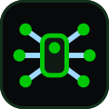
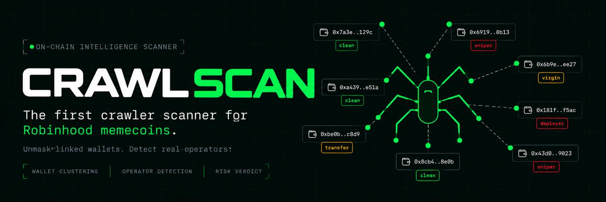
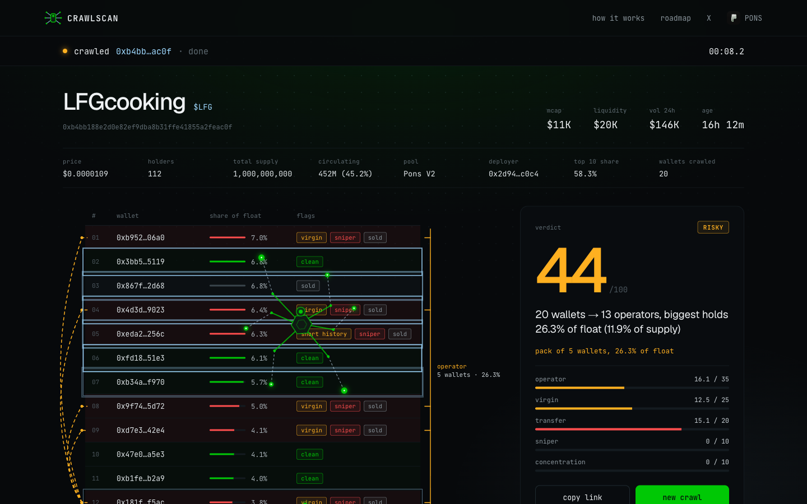

<div align="center">



# CRAWLSCAN

**Crawlers that catch one wallet wearing many.**

[](https://crawlscan.fun)


[](LICENSE)



</div>

## What is CRAWLSCAN?

**CRAWLSCAN is an on-chain token intelligence engine built to detect hidden wallet concentration, coordinated buying, and suspicious holder behaviour in seconds.**

Instead of simply showing how many holders a token has, CRAWLSCAN tries to answer the question that actually matters:

> **How many real participants are behind those wallets?**

A token can show hundreds of holders while a surprisingly large portion of its supply is controlled by the same person, the same group, or a network of connected wallets.

CRAWLSCAN crawls the token's on-chain history, analyses its top holders, follows transfers and trading behaviour, identifies wallet relationships, and turns the result into a simple **0-100 safety score**.

The goal is to make a complex on-chain investigation understandable in seconds without requiring users to manually inspect hundreds of transactions.

### The core idea

Paste a Pons V2 memecoin address on Robinhood Chain.

CRAWLSCAN analyses the token's holder structure and returns a verdict such as:

> **20 wallets -> 4 operators, biggest holds 38% of float**

What normally requires manual blockchain analysis can be reduced to a few seconds.

## Why CRAWLSCAN is different

Most token scanners answer questions like:

* How many holders does this token have?
* How much liquidity is available?
* Is the contract verified?
* What is the current price?

Those metrics are useful, but they don't necessarily tell you **who actually controls the supply**.

CRAWLSCAN looks deeper.

It analyses wallets as a network rather than treating every address as an independent holder.

For example:

```text
20 wallets
      |
wallet behaviour + transfers + trading history
      |
wallet relationships
      |
operator clustering
      |
real concentration
      |
0-100 verdict
```

This makes it possible to distinguish between:

**20 genuinely independent holders**

and

**20 wallets that may actually represent 4 operators.**

That distinction can completely change how a token's distribution should be interpreted.

## How the crawlers work

Everything starts with the token's **full transfer history since launch**.

CRAWLSCAN reconstructs the relevant holder and transaction activity directly from on-chain data. Curve contracts, liquidity pools, lockers, routers and other infrastructure addresses are excluded from the holder calculation so that the analysis focuses on actual wallets.

Every ownership percentage is measured against the **real circulating float**, rather than blindly using raw token balances.

### What CRAWLSCAN checks

Each wallet is analysed across multiple behavioural dimensions.

* **Bought vs received**: Determines whether a wallet actually bought tokens on the market or primarily received them through transfers.
* **Virgin wallets**: Identifies wallets with no meaningful previous trading history that appeared specifically around the token's launch.
* **History depth**: Looks at how much trading activity a wallet had before entering the token.
* **Snipers**: Detects wallets entering during the first seconds of a launch and tracks how much of their position remains.
* **Deployer behaviour**: Analyses what the token creator still holds, how much was sold, and how the deployer's position affects overall concentration.

### How wallets are linked

Counting wallets individually is not enough.

CRAWLSCAN therefore looks for evidence that multiple addresses may belong to the same operator.

**Proven links**

The strongest relationships come from observable on-chain connections, including:

* wallets participating in the same buy transaction;
* tokens originating from the same ordinary wallet;
* direct transfers between relevant holders.

When strong evidence connects wallets, they can be merged into a single **operator cluster**.

**Behavioural packs**

CRAWLSCAN also identifies groups of fresh wallets that:

* enter in the same block;
* buy similar amounts;
* exhibit similar launch behaviour.

These relationships are treated as **behavioural signals** rather than definitive proof of common ownership, so they receive a lower weight than direct on-chain links.

Infrastructure contracts, exchanges, distributors and other non-holder entities are deliberately excluded from wallet-to-wallet linking.

## Verdict

All of the collected signals are combined into a single score from **0 to 100**.

**100 = cleanest distribution**

The score is built from five major components:

| Signal            | What it measures                                                     |
| ----------------- | -------------------------------------------------------------------- |
| **Operator**      | How much of the float is controlled by the largest detected operator |
| **Virgin**        | The share of virgin wallets among the top holders                    |
| **Transfer**      | How much of the float was received rather than purchased             |
| **Sniper**        | How much float is still controlled by early sniper wallets           |
| **Concentration** | How much supply is concentrated among the top 20 holders             |

The system also applies hard rules for situations where a weighted score alone would be misleading.

* Critical concentration signals can force a `DANGER` verdict.
* Detected multi-wallet operators or suspicious packs can cap the result at `RISKY`.
* Insufficient holder activity can result in `TOO EARLY`.

The result is intentionally simple:

> **Complex on-chain investigation -> one understandable verdict.**

<div align="center">

</div>

## Self-learning intelligence

CRAWLSCAN is no longer a static ruleset.

The analysis engine is evolving into a **self-learning system** that improves as more people use it and more token behaviour is observed.

Every scan adds another real-world example to the system's experience.

Over time, this allows CRAWLSCAN to become better at recognising:

* recurring wallet behaviour;
* new patterns of coordinated activity;
* suspicious holder structures;
* different launch behaviours;
* relationships between wallets that may not be obvious from a single transaction;
* patterns that previously required manual interpretation.

The idea is simple:

> **The more the network is used, the more the system learns about how real token launches behave.**

This creates a feedback loop where usage improves the intelligence of the crawler, and improved intelligence makes future scans faster and more useful.

The long-term goal is to move from a scanner that simply **reads blockchain data** to an intelligence layer that can **recognise patterns across launches and continuously improve its analysis**.

## Built for speed

Blockchain analysis can become extremely expensive if every wallet is analysed sequentially.

CRAWLSCAN is designed around a strict time budget.

Multiple wallet crawlers run in parallel, allowing the system to inspect the most important addresses simultaneously instead of waiting for one slow wallet after another.

This means the final verdict is produced in seconds while the interface streams the analysis live.

The user can actually see the crawl happening:

```text
Token
  |
Top holders
  |
Wallet history
  |
Trades & transfers
  |
Wallet relationships
  |
Operator detection
  |
Risk scoring
  |
Verdict
```

## Technical architecture

CRAWLSCAN is intentionally lightweight.

* **Python 3.12**: Core crawler and analysis engine.
* **Python standard library**: Zero runtime dependencies.
* **Alchemy RPC**: Read-only on-chain access to Robinhood Chain.
* **GeckoTerminal**: Market and token data.
* **Transaction-level trade classification**: Identifies actual buys even when transactions pass through third-party trading routers or bots.
* **Parallel crawling**: Multiple wallets are analysed concurrently under a hard time budget.
* **Live event stream**: Analysis progress is streamed to the frontend as the crawl happens.
* **No private keys**: CRAWLSCAN never signs transactions or takes custody of funds.

The entire system is designed around one principle:

> **Read the chain. Understand the wallets. Never touch the user's funds.**

## Why this matters

A holder count is not the same thing as decentralisation.

A wallet address is not necessarily an independent participant.

And a token with many holders is not automatically a token with a healthy distribution.

CRAWLSCAN is built around that distinction.

Instead of asking only:

> **"How many holders does this token have?"**

it asks:

> **"How many independent participants actually appear to control the supply?"**

That is the layer of information CRAWLSCAN is designed to uncover.

## Run locally

```sh
echo "CRAWLER_RPC=https://robinhood-mainnet.g.alchemy.com/v2/<your-key>" > .env
python3 server.py
```

Open `http://localhost:8000`, or go straight to:

`http://localhost:8000/?ca=0x...`

## Roadmap

CRAWLSCAN is being developed from a token scanner into a broader **on-chain intelligence platform**.

### 🟢 In progress

* [ ] **Browser extension**
  The browser extension is already in development. It will bring CRAWLSCAN directly into the places where users discover and trade tokens, allowing them to analyse a token without leaving the page they are already using.

### 🔜 Next

* [ ] **Telegram bot**
  Run scans directly from Telegram by sending a token address and receiving the CRAWLSCAN verdict, score and key holder signals.

* [ ] **Operator memory across launches**
  Move beyond analysing wallets within a single token. Build persistent operator intelligence that can recognise wallet clusters and behavioural patterns across multiple launches.

* [ ] **Launch radar**
  Monitor new token launches and automatically surface tokens showing interesting, unusual or potentially dangerous holder behaviour.

* [ ] **Wallet profiler**
  Turn individual wallet analysis into a dedicated intelligence layer showing trading history, behaviour, recurring patterns and relationships across tokens.

### 🧠 Intelligence layer

* [ ] **Watchlists & alerts**
  Allow users to follow tokens, wallets and operators and receive alerts when meaningful changes occur, such as new concentration, coordinated buying or large operator movements.

* [ ] **Track record**
  Measure how CRAWLSCAN's signals perform over time. Compare predictions and risk scores against what happened to tokens after they were scanned.

  This creates a continuously improving feedback loop between the crawler's analysis and real-world outcomes.

### 🌐 Expansion

* [ ] **Multichain**
  Expand the CRAWLSCAN engine beyond Robinhood Chain and make the same wallet intelligence available across multiple EVM networks.

  The goal is to preserve the same core methodology, including holder analysis, operator detection, behavioural clustering and risk scoring, while adapting the crawler to each chain's infrastructure.

## Vision

CRAWLSCAN starts with one simple problem:

> **A blockchain shows you wallets. It doesn't always show you the people behind them.**

The goal is to build the intelligence layer that closes that gap.

From a simple token crawler today to a continuously learning network of wallet, operator and token intelligence tomorrow.

## License

[MIT](LICENSE)
